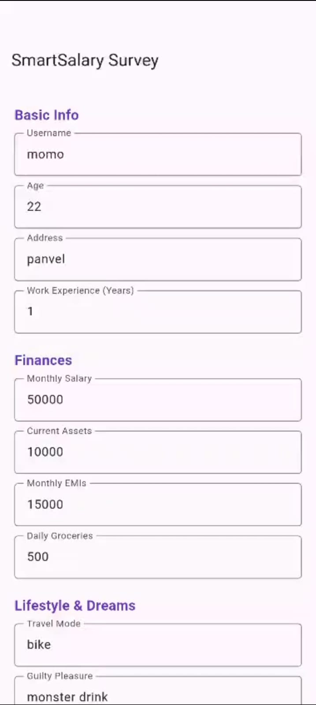
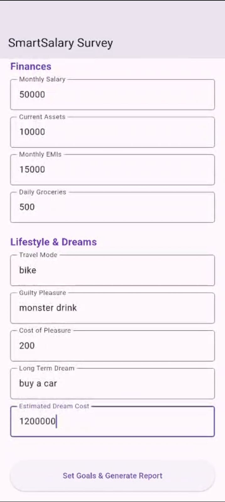
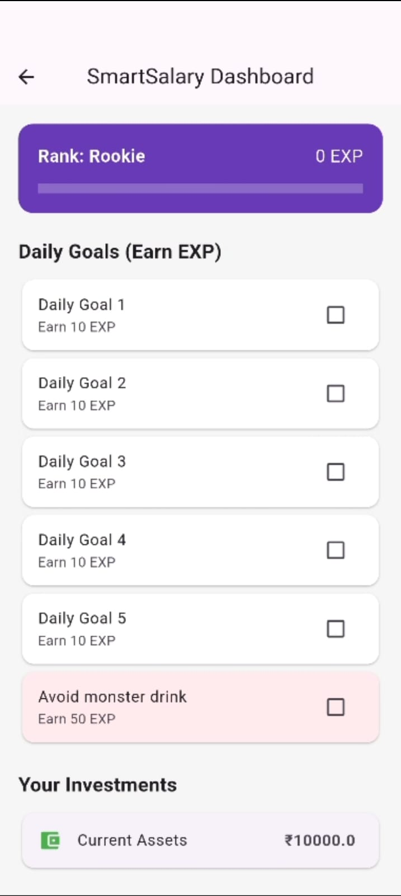
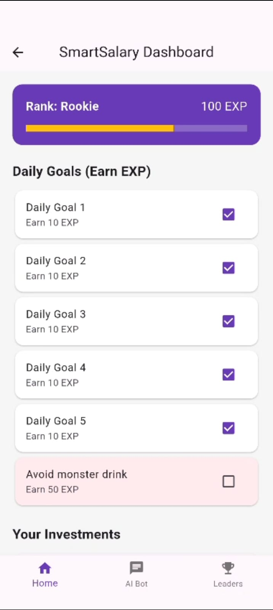
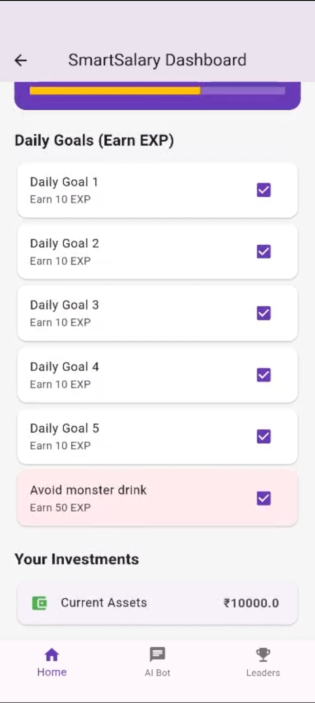
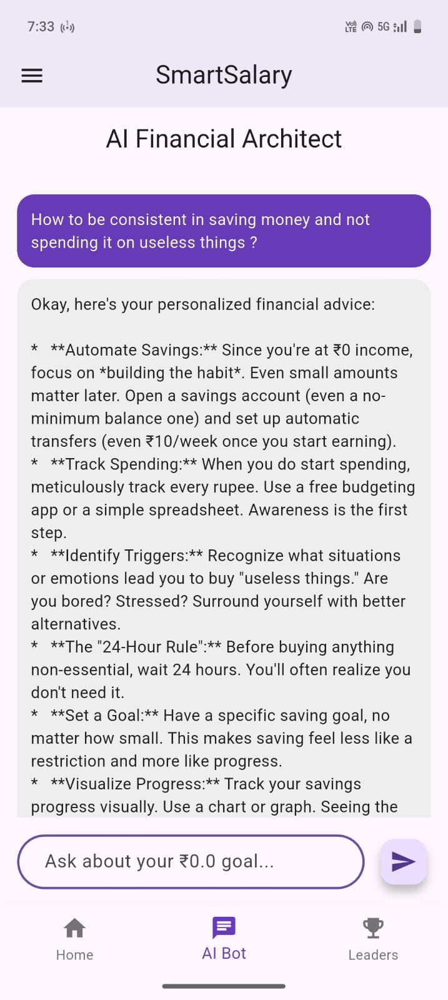

<<<<<<< HEAD
# Lotus Finance 🪷
**A Gamified Financial Habit Macker**

## 🚀 The Mission
Lotus Finance helps users master their personal finances through a "challenge" format. By combining real-time leaderboards with AI-driven progress analysis, we turn boring budgeting into a competitive game.

## ✨ Features
- **Smart Survey**: Tailored financial goal setting based on user salary and expenses.
- **Daily Task Gamification**: Earn EXP and rank up from "Rookie" to "Absolute Genius."
- - **Real-time Global Leaderboard**: Powered by Firebase Firestore to rank users by EXP.
- **Secure Authentication**: Firebase Auth integration for personal progress tracking.

## 🛠️ Tech Stack
- **Frontend**: Flutter (Dart)
- **Backend**: Firebase (Auth & Firestore)
- **AI**: Google Gemini Pro (for monthly progress reports)

## 📸 Screenshots
| Survey | Survey | Goal Confirmation |
|--------|-----------|-----------|
|  |  | 
 |

| Suggest New Goal | New Goal Approved |
|------|--------------|
|  |  |

| Smart_Salary Dashboard 1 | Smart_Salary Dashboard 2 | Smart_Salary Dashboard 3 |
|--------|-----------|-----------|
|  |  | 
 |

| AI Bot | Global Leaderboard |
|------|--------------|
|  |  |

## 🏗️ Installation
1. Clone the repo: `git clone [https://github.com/mohit-malpote/Lotus_Finance-Smart_Salary-]`
   OR
   *Download App:*[Vist here to download the app](https://github.com/mohit-malpote/Formula_Money-Fintech/releases)
   [How to Download app in Android devices:]
   1.Open the link in your andrid device.
   2.Go to the Releases page:
     👉 Open Releases
   3.Under Assets, download the latest APK file:
     Lotus_Finance_v1.0_Demo.apk
   4.Open the downloaded APK on your Android phone and give permission.
   5.Install the app and launch Formula_Money(Smart Salary).
2. Install dependencies: `flutter pub get`
3. Add your `google-services.json` to `android/app/`
4. Run: `flutter run`
=======
# lotus_finance_app

A new Flutter project.

## Getting Started

This project is a starting point for a Flutter application.

A few resources to get you started if this is your first Flutter project:

- [Lab: Write your first Flutter app](https://docs.flutter.dev/get-started/codelab)
- [Cookbook: Useful Flutter samples](https://docs.flutter.dev/cookbook)

For help getting started with Flutter development, view the
[online documentation](https://docs.flutter.dev/), which offers tutorials,
samples, guidance on mobile development, and a full API reference.
>>>>>>> 6d69ec1 (Initial MVP)
